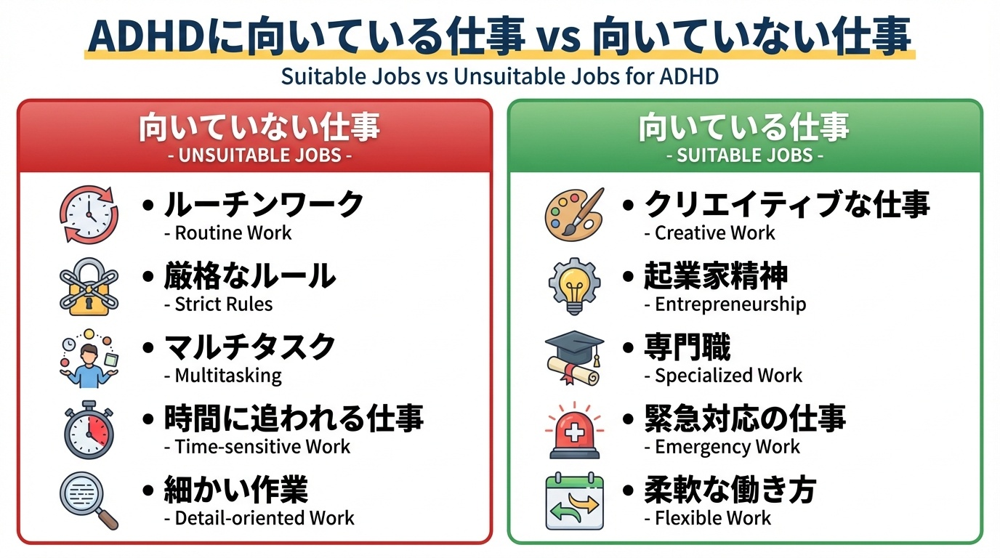
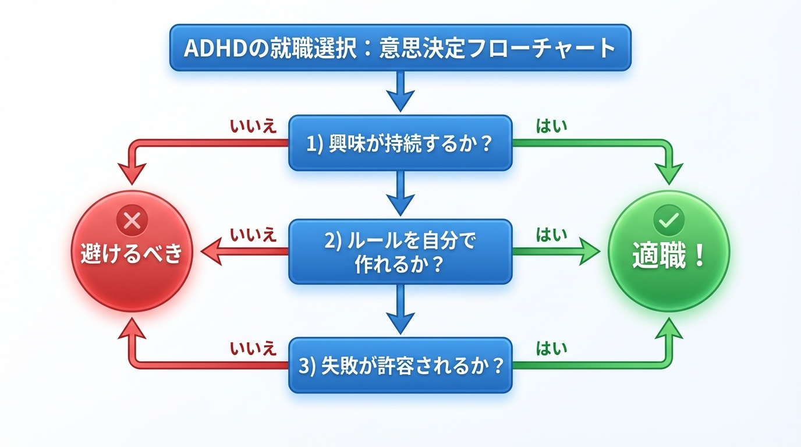

# ADHDに向いている仕事、向いていない仕事——会社員2年で挫折した僕が語る「本当の適職」の見つけ方

tags: ADHD, 仕事選び, キャリア, 社会不適合, 起業

「また遅刻してしまった」
「大事な書類を忘れた」
「上司に敬語が使えなくて怒られた」

会社員時代の僕は、こんな日常の繰り返しでした。

IQ130超のMENSA会員。東北大学卒業。客観的に見れば「優秀」とされるスペック。でも、会社員としては2年で限界を迎えました。

**理由はシンプル。ADHDだったから。**

遅刻癖、忘れ物癖、敬語が使えない、細かいルールが守れない——これらは単なる「性格の問題」ではなく、脳の構造の話だったんです。

でも、その後フリーランスを経由せず、いきなり株式会社を設立。10年間生き残って、今では生成AI教育の会社を経営しています。

**つまり、ADHDだから働けないわけじゃない。向いている環境を選べば、むしろ強みになる。**

この記事では、会社員を2年で挫折した僕が、実体験をもとに「ADHDに向いている仕事・向いていない仕事」を本音で語ります。

---

## ADHDの特性を理解する

まず、ADHDとは何かを整理します。

ADHDは「注意欠如・多動症」の略で、脳の実行機能に関する発達の特性です。主な特徴は：

- **不注意**: 細かいミスが多い、忘れ物・なくし物が多い、集中力が続かない
- **多動性**: じっとしていられない、落ち着きがない
- **衝動性**: 思いついたらすぐ行動する、順番を待てない、話を遮る

僕の場合：
- 時間管理が壊滅的（遅刻常習犯）
- 書類管理ができない（重要書類を紛失）
- マルチタスクが苦手（複数の指示を同時に受けると混乱）
- ルーティンワークが苦痛（同じ作業の繰り返しで集中力が切れる）
- 過集中がある（興味あることは寝食忘れて没頭）

ADHDには「向いていないこと」と「むしろ得意なこと」があるんです。

---

## ADHDに向いていない仕事

実体験と多くのADHD当事者の声を元に、向いていない仕事の特徴をまとめました。

### 1. ルーティンワークが中心の仕事

**具体例**:
- 事務作業（データ入力、書類整理、経理）
- 工場のライン作業
- コールセンター（マニュアル対応）

**理由**:
ADHDの脳は「新しい刺激」を求めます。同じ作業の繰り返しはドーパミンが出ず、集中力が持続しません。僕も会社員時代、Excelに数字を入力する業務が地獄でした。5分で飽きて、気づいたらネットサーフィンしてました。

### 2. 細かいルールや手順が厳格な仕事

**具体例**:
- 公務員（規則に基づく業務が多い）
- 銀行・金融機関（コンプライアンスが厳しい）
- 大企業の総務・人事（社内規程が膨大）

**理由**:
「この書類はA部署の承認後、B部署に回して…」みたいな複雑な手順を覚えるのが苦手。僕は社内の稟議フローが理解できず、何度も怒られました。

### 3. マルチタスクが要求される仕事

**具体例**:
- 秘書・アシスタント業務
- 飲食店のホールスタッフ（複数のテーブルを同時対応）
- プロジェクトマネージャー（複数案件の同時進行）

**理由**:
「Aさんの資料作りながら、Bさんの電話対応して、Cさんの会議準備」みたいな状況になると、僕の脳はフリーズします。優先順位がつけられなくなり、全部中途半端になる。

### 4. 時間管理が厳格な仕事

**具体例**:
- 営業（アポイントメントが分刻み）
- 接客業（シフト厳守）
- 医療職（手術や診察のスケジュールが厳密）

**理由**:
ADHDは時間感覚が弱い傾向があります。「あと10分で出発」が理解できず、気づいたら30分遅刻してる。僕は大学時代、1限に間に合った記憶がほぼありません。

### 5. 細かいミスが許されない仕事

**具体例**:
- 経理・会計（1円の誤差も許されない）
- 薬剤師（調剤ミスは命に関わる）
- 法務（契約書の一文字ミスが訴訟リスク）

**理由**:
不注意特性があるADHDは、どんなに気をつけても細かいミスをします。僕も書類の誤字脱字、数字の入力ミスは日常茶飯事。「気をつければいいでしょ」と言われても、脳の構造的に難しいんです。

---

## ADHDに向いている仕事

逆に、ADHDの特性を活かせる仕事もあります。

### 1. クリエイティブ系

**具体例**:
- デザイナー
- ライター
- 映像制作
- アーティスト

**理由**:
ADHDは「発散思考」が得意。アイデアを次々と生み出す能力が高い。ルールに縛られず、自由に発想できる環境では力を発揮します。

僕も、AI教材の企画や教育プログラムのデザインは大好き。誰もやってないことを考えるのはワクワクします。

### 2. 起業・フリーランス

**具体例**:
- 経営者
- フリーランスエンジニア
- 個人事業主

**理由**:
**自分でルールを作れるから。**

会社員時代、「9時出社」が守れなくて苦しんだ僕。でも起業後は「10時スタート」にしたら問題解決。遅刻という概念がなくなりました。

ADHDは既存のルールに合わせるのは苦手ですが、自分で環境をデザインするのは得意です。

### 3. 専門性が高く、興味が持続する仕事

**具体例**:
- エンジニア（特に新技術に触れられる環境）
- 研究者
- コンサルタント

**理由**:
ADHDには「過集中」という特性があります。興味があることには、寝食を忘れて没頭できる。

僕は生成AIにハマってから、毎日12時間以上勉強しても全く苦じゃなかった。むしろ楽しくて仕方なかった。

**ポイント**: ルーティンではなく、常に新しい課題がある仕事が◎

### 4. 緊急性が高い仕事

**具体例**:
- 救急医療
- 消防士
- 記者（締め切り駆動）

**理由**:
ADHDは「締め切り直前」に異常な集中力を発揮します。これはアドレナリンが出るため。

僕も大学のレポートは、締め切り前日に徹夜で仕上げるのが常でした。逆に「余裕のある時」は全く手がつかない。

緊急性の高い仕事は、常にアドレナリンが出るので、ADHDの脳と相性が良いです。

### 5. 裁量が大きく、自分のペースで進められる仕事

**具体例**:
- コンサルタント
- 講師・トレーナー
- プロジェクトリーダー（少人数チーム）

**理由**:
「どうやるか」を自分で決められる環境は、ADHDにとって天国。

僕が講師をやっている「AIプログラミング2Daysキャンプ」は、教え方も進行も全部自分で決められる。だから楽しいし、成果も出せる。

---

## 「向いている仕事」を見つける判断軸

### 判断軸1: 「興味が持続するか」

ADHDにとって最重要なのは「興味」です。

興味がないことは、どんなに頑張っても続きません。脳がドーパミンを出さないから。

逆に、興味があることは放っておいても勝手にやります。

**チェック方法**:
- 休日に無意識にやってしまうことは何？
- お金にならなくても調べてしまうテーマは何？
- 時間を忘れて没頭できることは何？

僕の場合、生成AIや教育メソッドについて考えるのは、仕事というより趣味。だから続けられる。

### 判断軸2: 「ルールを自分で作れるか」

会社員として働く場合でも、裁量の大きい仕事を選ぶべきです。

**良い例**:
- 営業（訪問スケジュールを自分で決められる）
- エンジニア（実装方法を自分で選べる）
- 企画職（提案内容を自分で考えられる）

**悪い例**:
- 事務（手順が完全に決まっている）
- オペレーター（マニュアル通りの対応必須）
- 製造（ライン作業でペースが決まっている）

### 判断軸3: 「失敗が許容される環境か」

ADHDは絶対にミスをします。これは避けられません。

だから、「ミスが致命的にならない仕事」を選ぶべき。

**ミスが致命的な仕事（避けるべき）**:
- 経理（1円のズレも許されない）
- 薬剤師（調剤ミスは命に関わる）
- パイロット（ミス=事故）

**ミスがリカバリー可能な仕事（おすすめ）**:
- Webデザイン（修正が効く）
- ライター（校正がある）
- エンジニア（テストで検出できる）

僕も経営者として、社員に「失敗してもいい」文化を作っています。失敗を許容しない環境では、ADHDは生きられません。

---

## 僕が「起業」という選択をした理由

会社員を2年で辞めた僕は、フリーランスを経由せず、いきなり株式会社を設立しました。

**理由は3つ:**

### 1. 既存のルールに合わせるのが無理だった

「9時出社」「報告・連絡・相談」「稟議書のフォーマット」——会社のルールが全部苦痛でした。

起業すれば、自分でルールを作れる。「10時スタートでOK」「報告は必要最低限」「稟議書なんてない」——全部自分で決められる。

### 2. 過集中を最大限に活かせる

会社員時代、「今これに集中したい！」と思っても、会議や雑務で遮られることが多かった。

起業後は、集中したい時に集中できる。誰にも邪魔されない。結果、生産性が爆上がりしました。

### 3. 興味のあることしかやらなくていい

会社員だと、興味のない仕事も振られます。「やる気が出ない」と言っても、「仕事だから」と言われる。

起業すれば、自分が興味のある事業だけをやればいい。僕は生成AI教育に全振りしています。

---

## まとめ: ADHDは「環境選び」が全て

ADHDだから働けないわけじゃない。
**ただ、向いている環境と向いていない環境の差が大きいだけ。**

向いていない環境で頑張っても、本人も周りも不幸になります。

逆に、向いている環境を選べば、ADHDの特性は「強み」に変わります。

**ポイントは:**
- 興味が持続する仕事を選ぶ
- ルールを自分で作れる環境を選ぶ
- 失敗が許容される文化を選ぶ

僕は会社員を2年で挫折しましたが、起業して10年生き残っています。

訴訟2回、2000万円の損失、役員の裏切り——色々ありましたが、それでも「自分でルールを作れる」環境は最高です。

**あなたも、「普通」に合わせる必要はない。
自分の特性を活かせる場所を、選んでいい。**

---

## 著者プロフィール

**伊東雄歩（いとうゆうほ）**

株式会社ウォーカー代表取締役 / MENSA会員 / NLPマスタープラクティショナー

IQ130超のADHD経営者。「社会不適合」ゆえに会社員を2年で挫折し、フリーランスを経由せずいきなり起業。訴訟2回、2000万円の損失、役員の裏切り、オフショア開発の地獄を乗り越え10年生き残る。心理学・教育学に1000万円投資し、独自の「成長力学」を確立。現在は生成AI教育に注力し、「3年を2日に変える」AIプログラミング2Daysキャンプを全国展開中。継続率90%のAIフレンズコミュニティを運営。

夢は「世界征服」——世界の常識を変え、新しい価値観を提示すること。

- note: https://note.com/yuho_walker
- Twitter: @itoWalker
