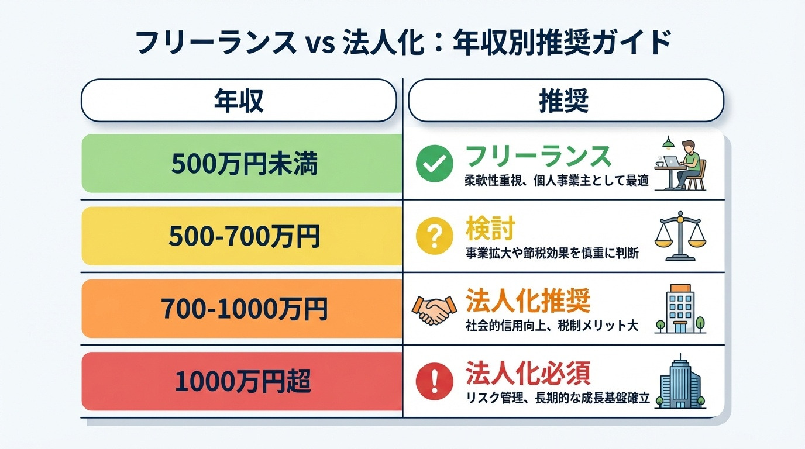
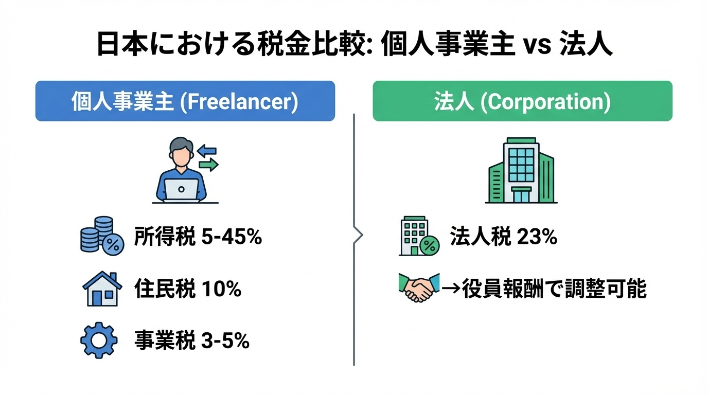
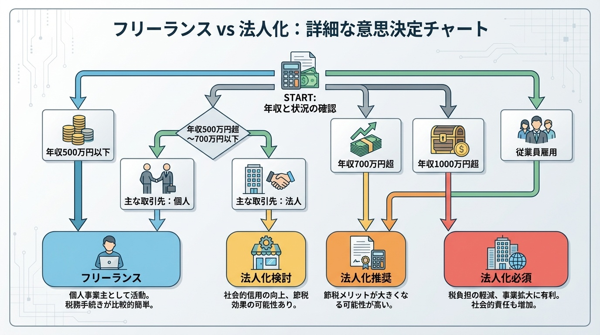

# フリーランスvs法人化——年収別の判断基準チャート

tags: フリーランス, 法人化, 年収, 判断基準, 起業, 税金

「年収いくらになったら法人化すべき？」

フリーランスとして働いていると、必ずこの疑問にぶつかる。

僕は2015年にフリーランス経験なしでいきなり法人を設立した。
10年間の経営で、フリーランスの友人たちの法人化も何度も相談に乗ってきた。

結論から言うと、**年収だけで判断するのは危険**。

でも、目安は必要だ。
この記事では、年収別の判断基準を「チャート形式」で整理した。

---

## 結論：年収別の判断基準チャート

ざっくり言うと：
- **500万円以下** → フリーランス継続（法人維持コストが割に合わない）
- **500〜700万円** → 条件次第で検討
- **700〜1000万円** → 法人化推奨（税金・社会保険のメリット大）
- **1000万円以上** → 法人化ほぼ必須（節税効果が大きい）

ただし、これはあくまで**税金面だけ**を見た場合の話。
実際には「信用」「リスク」「手間」も考慮する必要がある。

---

## フリーランスvs法人、何が違う？

### 1. 税金の違い

**フリーランス（個人事業主）**は累進課税。
年収が上がるほど、税率が上がる。
年収1000万円を超えると、所得税だけで33%取られる。

**法人**の場合、利益を「役員報酬」と「会社の利益」に分けられる。
この分散ができるのが、法人最大のメリット。

### 2. 社会保険の違い

**フリーランス**
- 国民健康保険：収入に応じて増加（上限あり）
- 国民年金：月額約16,500円（定額）

**法人**
- 健康保険＋厚生年金：会社と折半
- 役員報酬を下げれば、社会保険料も下がる

ここがポイント。
法人化すると、役員報酬を調整することで社会保険料をコントロールできる。

### 3. 信用の違い

**フリーランス**
- 大企業との取引はハードル高い
- 銀行融資も個人より不利

**法人**
- 大企業との取引がしやすい
- 「株式会社」の看板で信用が上がる

僕が法人化した最大の理由はこれだった。
大企業は「個人とは取引しない」ポリシーのところが多い。

---

## 年収500万円以下：フリーランス継続が正解

### 法人化のコスト

法人を維持するには、年間で最低でも**30〜50万円**のコストがかかる。

- 設立費用：約25万円（株式会社の場合）
- 税理士顧問料：月2〜5万円
- 法人住民税：赤字でも年間7万円
- 社会保険の手続き：毎月の事務作業

年収500万円以下だと、このコストを回収できない。
青色申告の65万円控除を使って、フリーランスを続けるのが賢い。

### フリーランスでできる節税

- 青色申告特別控除：65万円
- 経費計上：家賃、通信費、交通費など
- 小規模企業共済：年間84万円まで所得控除
- iDeCo：年間81.6万円まで所得控除

これだけでかなりの節税ができる。

---

## 年収500〜700万円：条件次第で検討

### 法人化を検討すべき人

**大企業との取引がある（またはしたい）**
法人格がないと契約できない案件がある。信用面でのメリットが大きい。

**将来的に人を雇いたい**
個人事業で雇用すると手続きが煩雑。法人の方がスムーズ。

**事業リスクが高い**
法人なら有限責任（個人資産を守れる）。訴訟リスクがある事業は法人化推奨。

### まだフリーランスでいい人

**一人で完結する仕事**
エンジニア、ライター、デザイナーなど。取引先が個人でもOKな場合。

**事務作業を増やしたくない**
法人は決算、社会保険、登記など手続きが多い。

---

## 年収700〜1000万円：法人化推奨

### 税金シミュレーション（年収800万円の場合）

**フリーランスの場合**
所得税＋住民税＋事業税＋国民健康保険 → **合計：約230万円**

**法人（役員報酬500万円、会社利益300万円）の場合**
個人の税金＋法人税＋社会保険料 → **合計：約210万円**

差額：約20万円の節税。
さらに、会社に残った利益は「退職金」として将来受け取れる。

### 法人化のタイミング

年収700万円を超えたら、税理士に相談するのがベスト。

**消費税**の観点も重要。
課税売上1000万円を超えると、2年後から消費税がかかる。
法人化すると、最初の2年間は免税になる（条件あり）。

このタイミングを狙って法人化する人も多い。

---

## 年収1000万円以上：法人化ほぼ必須

### なぜ必須なのか

**所得税率が33%を超える**
法人税率（約23%）との差が大きい。分散するだけで10%以上の節税。

**社会保険料の上限問題**
国民健康保険は年間約100万円が上限。法人化して役員報酬を調整した方が有利。

**退職金という出口戦略**
法人に利益を残しておき、退職時に退職金として受け取る。退職金は税制優遇が大きい。

### 注意点

法人化しても「節税」だけが目的だと失敗する。
事業として成長させる意識が必要。
税理士選びも重要（法人に強い人を選ぶ）。

---

## 僕が「いきなり法人化」した理由

2015年、僕はフリーランス経験なしで株式会社を設立した。

理由は3つ：

**1. 大企業と取引したかった**
個人だと門前払いされる案件が多かった。法人格があるだけで、話を聞いてもらえる。

**2. 本気度を示したかった**
「株式会社」という看板があると、相手の態度が変わる。自分自身へのコミットメントにもなった。

**3. 将来の拡大を見据えていた**
最初から「一人で終わらせる」つもりがなかった。人を雇う前提で始めた。

結果として、法人化は正解だった。
設立1年目から大企業との取引が始まり、売上は順調に伸びた。

---

## 法人化の具体的な手順

**1. 税理士に相談**
いきなり設立せず、まず相談。シミュレーションしてもらう。

**2. 会社形態を決める**
株式会社 or 合同会社。合同会社は設立費用が安い（約10万円）。

**3. 定款作成・登記**
司法書士に依頼するのが一般的。自分でやることも可能。

**4. 銀行口座開設**
最近は審査が厳しい。事業計画書を準備しておく。

**5. 社会保険の手続き**
年金事務所、ハローワークなど。税理士 or 社労士に依頼推奨。

---

## まとめ：判断基準チャート（詳細版）

迷ったら、**税理士に無料相談**してみるのが一番。
最近は初回無料の税理士も多い。

数字で判断できることは、数字で判断しよう。

---

## 著者プロフィール

**伊東雄歩（いとうゆうほ）**

株式会社ウォーカー代表取締役。2015年にフリーランス経験なしで法人設立。
10年間の経営で、売上ゼロから年商数千万円まで成長させた。

「社会不適合がAIで人生を変える方法」を発信中。

Twitter: [@yuho_misfit](https://twitter.com/yuho_misfit)
