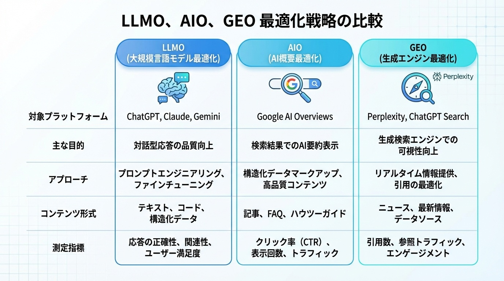

# LLMO・AIO・GEOとは？生成AI時代の3つの新SEO戦略を完全解説

tags: LLMO, AIO, GEO, 生成AI, ChatGPT, SEO, AI時代

あなたのコンテンツ、ChatGPTに引用されていますか？
Google AI Overviewsで表示されていますか？
Perplexityの回答で参照されていますか？

2025年を境に、検索の世界は完全に変わりました。従来の「Google検索で上位表示を目指す」だけでは、もう不十分なのです。

今回は、生成AI時代の3つの新しい最適化戦略「LLMO」「AIO」「GEO」について、AI教育の現場で活動してきた私の視点からお伝えします。

---

## 生成AI時代の「新・検索最適化」3本柱

まず、3つの概念を整理しましょう。

- **LLMO**（Large Language Model Optimization）— ChatGPT、Claude、Geminiなど対話型AIへの最適化
- **AIO**（AI Overviews Optimization）— Google AI Overviewsへの最適化
- **GEO**（Generative Engine Optimization）— Perplexity、ChatGPT検索など生成検索エンジンへの最適化

これら3つは、従来のSEOの「進化形」であり、互いに補完し合う関係にあります。

---

## LLMO（大規模言語モデル最適化）とは？

**LLMO** とは、ChatGPTやGemini、Claudeなどの生成AIがユーザーの質問に回答する際に、**あなたのWebコンテンツが参照・引用される確率を高めるための施策**です。

### なぜLLMOが重要なのか？

私がAI教育の現場で感じているのは、ユーザーの情報収集行動が劇的に変化したということです。

以前なら「〇〇とは」とGoogle検索していた人が、今では「〇〇について教えて」とChatGPTに聞いています。

**この変化は不可逆的です。**

一度AIとの対話で情報収集する便利さを知った人は、もう元には戻りません。

### LLMOの具体的施策

1. **Q&A形式のコンテンツ** — AIは「質問→回答」の形式を好む
2. **一次情報の提供** — 独自のデータ、実体験、専門家としての見解
3. **構造化データの実装** — JSON-LD形式でAIの理解を助ける
4. **情報の鮮度維持** — 定期更新、公開日・更新日の明記
5. **信頼性の証明** — 著者プロフィール、参考文献、実績の明示

---

## AIO（AI Overviews最適化）とは？

**AIO** とは、Googleの検索結果最上部に表示される**AIによる要約（AI Overviews）**に、あなたのコンテンツが引用されるための最適化です。

### AI Overviewsの衝撃

Google検索に統合されたAI Overviewsは、検索結果の最上部にAIによる要約を表示します。

これにより起きていること：
- ユーザーは**個別サイトをクリックせずに回答を得る**
- 従来の「検索1位」の価値が相対的に低下
- **引用元として選ばれるか否か**が新たな勝負どころに

つまり、「検索1位を取る」だけでは、もうビジネスインパクトを生み出しにくくなっているのです。

### AIOの具体的施策

1. **網羅的なコンテンツ** — ユーザーの検索意図を深く理解した内容
2. **信頼性の高い情報源の明示** — 出典、参考文献、専門家監修
3. **簡潔な要約の提供** — AI が引用しやすい「まとめ」セクション
4. **E-E-A-Tの強化** — 経験・専門性・権威性・信頼性の証明

---

## GEO（生成エンジン最適化）とは？

**GEO（Generative Engine Optimization）** とは、Perplexity、ChatGPT検索、Microsoft Copilotなどの**生成AI搭載検索エンジン**に対する最適化です。

### 従来のSEOとGEOの違い

従来のSEO：
- Googleのクローラーに最適化
- キーワードマッチングが中心
- 「10個の青いリンク」での上位表示

GEO：
- 生成AIの回答生成に最適化
- **意味・文脈の理解**が中心
- 「AIの回答に引用される」ことが目標

### GEOが注目される理由

PerplexityやChatGPT検索の台頭により、「AIに聞く」という検索行動が急増しています。

これらの生成エンジンは、Web上の情報を参照して回答を生成します。つまり、**あなたのコンテンツが引用されれば、ユーザーに直接届く**のです。

### GEOの具体的施策

1. **引用されやすい構造**
   - 明確な見出し階層
   - 箇条書きによる要点整理
   - 数値データや統計の明示

2. **権威性の証明**
   - 専門家としての実績
   - 信頼できる外部ソースの引用
   - 著者情報の充実

3. **独自性の確保**
   - オリジナルの調査・分析
   - 実体験に基づく知見
   - 他にはない視点の提供

4. **技術的な最適化**
   - 構造化データの実装
   - ページ読み込み速度の改善
   - モバイルフレンドリーな設計

---

## 3つの戦略の違いと共通点

### 違い

| 項目 | LLMO | AIO | GEO |
|:---|:---|:---|:---|
| 対象 | ChatGPT等のLLM | Google AI Overviews | Perplexity等の検索AI |
| 特徴 | 対話型AI向け | Google検索統合型 | Web検索+AI生成型 |
| 出力形式 | 会話形式の回答 | 検索結果上部の要約 | 引用付きの回答 |

### 共通点

**「ユーザーの検索意図に、最高の品質で応える」**

| 共通要素 | 説明 |
|:---|:---|
| E-E-A-T | 経験・専門性・権威性・信頼性は全てに共通 |
| 構造化データ | AIの理解を助け、全戦略に効果的 |
| 一次情報 | 独自の価値を提供することで引用される |
| 信頼性 | どの最適化も「信頼される情報源」が前提 |

---

## 実践ケース：私のコンテンツ戦略

私自身、以下のように3つの戦略を組み合わせています。

### LLMO対策
- AI教育の現場で得た**独自の知見**を発信
- Q&A形式で「よくある質問」に明確に回答
- 「成長力学」など**独自フレームワーク**の提示

### AIO対策
- 記事冒頭に**結論を明示**
- 構造化データで**FAQスキーマ**を実装
- 参考文献を明記して**信頼性を担保**

### GEO対策
- Perplexityで自分のコンテンツが**どう引用されているか**を定期チェック
- **数値データや具体例**を積極的に盛り込む
- 引用されやすい**箇条書き形式**でまとめを作成

---

## AIに仕事を奪われるか、AIを味方につけるか

私は常々、こう言っています。

**「AIに仕事を奪われるのではなく、AIを味方につける」**

LLMO・AIO・GEOも同じです。

生成AIの台頭を「脅威」と捉えて何もしないか、「機会」と捉えて先手を打つか。

違いを生むのは、**行動するかどうか**だけです。

---

## まとめ

- **LLMO** — ChatGPT等のLLMに引用されるための最適化
- **AIO** — Google AI Overviewsに掲載されるための最適化
- **GEO** — Perplexity等の生成検索エンジンに引用されるための最適化
- 3つの戦略は**相互補完関係**、共通の本質は「E-E-A-T」
- 今日から始めることで、**AI時代の先行者利益**を獲得できる

2026年、あなたのコンテンツは「検索される」だけでなく「引用される」時代に適応していますか？

まずは一つ、今日から始めてみてください。

---

## 著者プロフィール

**伊東雄歩（いとうゆうほ）**

株式会社ウォーカー代表取締役。MENSA会員。

2017年よりDeepLearning協会（JDLA）認定講座講師として活動。AI教材「StoQ」開発、産学連携DXプログラム「Digitech Quest」全国展開、AI学習コミュニティ「AIフレンズ」運営など、生成AI時代の教育に取り組む。

「失敗は経験の元」を座右の銘に、AIを活用した新しい学びの形を追求中。

note: https://note.com/yuho_walker
X: @itoWalker
